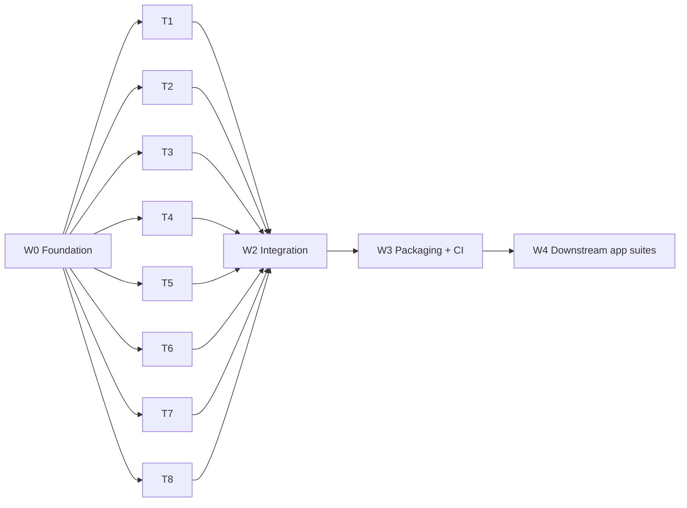

# 11 — Build plan

Status: plan. It splits the build in `docs/09` into waves and parallel tracks.
Definition of done: every official SDK's live integration suite passes against postmock.
Each allowed exception is listed in `conformance/<sdk>/skips/<test file>.json` with a reason.

## 1. Decisions taken

| # | Decision | Effect |
| --- | --- | --- |
| B1 | Name: **postmock**. npm `postmock` is taken, so the package is scoped (`@benclmnt/postmock`). The Docker image is `postmock`. | README, package.json, image tags |
| B2 | No live captures for now. `docs/10` stays as a later fidelity pass. | `docs/09` P0 is deferred |
| B3 | Without captures, an SDK **live integration test** is the strongest source. These tests ran against real Postmark. Source order: CAPTURED > SDK live test > DOC > other SDK code > INFERRED. | Resolves the doc-vs-SDK conflicts in `docs/08` |
| B4 | One toolchain source: `flake.nix` dev shell (Node 24, pnpm, .NET 8, PHP 8.3 + Composer, JDK 17 + Maven, Ruby 3.3, Python 3.12 + Poetry, OpenSSL). CI uses the same flake. | No per-machine setup drift |
| B5 | Stack: TypeScript strict, ESM, Node 24, pnpm, hono, smtp-server, mailparser, zod, vitest, biome. | `docs/09` §3 |

Toolchain versions come from `nix eval nixpkgs#<pkg>.version` on 2026-09-16: dotnet-sdk_8 8.0.424, php83 8.3.33, jdk17 17.0.19, maven 3.9.16, ruby_3_3 3.3.10, python312 3.12.14.
SDK requirements: .NET tests target `netcoreapp3.1`, but their xUnit adapter has no build for it, so the runner builds them for `net8.0` (`TESTING.md` traps); Java 1.8 source; PHP ~8.1–8.4; Ruby 3.2; Python ≥3.10; Node ≥18.

## 2. Repo layout

| Path | Owner | Content |
| --- | --- | --- |
| `src/main.ts` | W0 | Starts the listeners from config |
| `src/http/` | W0 | App factory, request normalization (path, query and body key case; booleans; dates), JSON responder, auth middleware, route registry |
| `src/errors.ts` | W0 | The full ErrorCode table (`docs/02`): code → HTTP status → `Message` template |
| `src/state/` | W0 | Entity types for the whole surface, the `Store`, id generators, the virtual clock |
| `src/pipeline/` | W0 contract, T1 body | `validateOutbound()` (data checks, no state change), `acceptOutbound()` (approval, suppression check, store, emit events), `submitOutbound()` (both) |
| `src/events.ts` | W0 | Typed event bus: sent, delivered, bounced, opened, clicked, spamComplaint, subscriptionChange, inboundReceived, smtpApiError |
| `src/api/<group>/` | T1–T5, T7 | One folder per API group: `routes.ts`, `schemas.ts`, unit tests |
| `src/render/` | T3 | Mustachio renderer |
| `src/webhooks/`, `src/inbound/` | T5 | Emitter with retries on the virtual clock; inbound parse and rules |
| `src/smtp/` | T6 | SMTP listener |
| `src/control/` | W0 skeleton, every track adds files in `endpoints/` | Control API (`docs/09` §5) and seed loader |
| `seeds/` | W0 format, tracks add parts in `seeds/conformance/` | Named seeds: `empty`, `conformance` (`docs/08` harness seed) |
| `conformance/<sdk>/` | W0 for postmark.js, T8 for the rest | `run.ts`, shims, `testing_keys.json`, `baseline/<test file>.json`, `skips/<test file>.json` |
| `examples/node/`, `Dockerfile`, `compose.yaml`, `.github/workflows/` | W3 | Packaging and CI |

Rule: a track edits only its own paths. A change to a W0 contract goes through the integrator (§5).

## 3. Waves

### 3.1 W0 — Foundation (one agent, sequential)

| Deliverable | Exit check |
| --- | --- |
| `flake.nix`, pnpm workspace, tsconfig strict, biome, vitest | `nix develop -c pnpm check` passes |
| Request normalization and responder (`docs/08` accept rules R1–R15, emit rules E1–E16) | Unit tests per rule E1–E13; E14–E16 are conflicts the owning track decides (T1, T3, T7) |
| `errors.ts` with every ErrorCode in `docs/02` | A test asserts one entry per documented code |
| Auth: server token, account token, `POSTMARK_API_TEST`, 401/10 | Unit tests |
| State types for every entity in `docs/03`–`docs/07`; `Store`; clock; ids | Typecheck; the types cover every response schema in `docs/08` |
| Contracts: `submitOutbound()` signature, event bus, route registry, control API skeleton (`reset`, `seed`, `clock/advance`, `faults`, `messages`) | Stub implementations; `GET /server` works end to end |
| postmark.js conformance runner: `pnpm conformance postmark.js` starts postmock with a seed, runs the suite with the preload shim, writes `conformance/results/postmark.js.json` | Runs the suite; the report lists pass/fail per test; `Server` tests pass |
| Result ratchet: `pnpm conformance:check` fails when a test in `conformance/<sdk>/baseline/` stops passing, or the results are stale | Unit test on the comparer |

W0 fixes the contracts that tracks share. It is the only serial step.

### 3.2 W1 — Parallel tracks

Each track runs in its own git worktree and branch.
Each track ends with a fresh-context review, then merges through the integrator.

| Track | Scope (`docs/09` modules) | Sources | Exit: tests that must pass |
| --- | --- | --- | --- |
| T1 Sending | `validateOutbound`, `acceptOutbound`, `submitOutbound`; `POST /email`, `/email/batch`; attachments, headers, metadata, tracking flags; 300/406/411/1235 errors; partial suppression | `docs/03`, `docs/01` §4 | postmark.js `Sending` (non-template); php `PostmarkClientEmailTest`; rails `delivery_spec`, `batch_delivery_spec` |
| T2 Suppressions, bounces, streams, data removals | State transitions T1–T17 (`docs/04` §3.2); bounces API; streams CRUD, archive; suppressions; data removals | `docs/04` | postmark.js `Suppressions`, `Bounce`, `MessageStreams`, `DataRemoval`; dotnet `ClientSuppressionTests`, `ClientBounceTests`, `ClientMessageStreamTests`; java `SuppressionsTest`, `BounceTest`, `MessageStreamsTest` |
| T3 Templates and bulk | Templates CRUD, validate, layouts; Mustachio renderer; `withTemplate`, `batchWithTemplates`; bulk send and status | `docs/03`, `docs/06` §3 | postmark.js `Templates`; dotnet `ClientTemplateTests`, `ClientBulkSendingTests`; php `PostmarkClientTemplatesTest`; java `TemplateTest`, `TemplatedMessageTest` |
| T4 Messages, events, stats | Outbound and inbound search, details, dump; opens, clicks; stats aggregation from events; paging caps | `docs/06` §1–2 | postmark.js `Messages`, `MessagesOpens`, `MessageStatistics`, `ClickStatistics`; dotnet `ClientMessage*Tests`, `ClientStatisticsTests`; gem `api_client_messages_spec` |
| T5 Webhooks and inbound | Webhooks config API; emitter for every RecordType; retries on the virtual clock; legacy hook URLs; inbound parse, rules, bypass, retry; `/server` hook fields | `docs/05` | postmark.js `Webhook`, `Triggers`, `Server`; dotnet `ClientWebhookTests`, `ClientTriggersTests`, `ClientServerInformationTests`; java `WebhookTest`, `TriggersTest` |
| T6 SMTP | Listeners 25/587/2525; STARTTLS; AUTH with server token and SMTP token; MIME to `submitOutbound`; `X-PM-*` headers; `SMTPApiError` bounces | `docs/07` | vitest suite driving nodemailer 9 and `smtp-server` edge cases (`docs/07` Mock must); `examples/node` SMTP send |
| T7 Account API | Servers, domains (DKIM/return-path verify as control-API toggles), sender signatures, template push | `docs/06` §4, `docs/08` §2.2 | postmark.js `Servers`, `Domains`, `Signatures`; dotnet `AdminClient*Tests`; php `PostmarkAdminClient*Test`; java `ServersTest`, `DomainTest`, `SendersTest`, `TemplatePushTest`; gem `account_api_client_spec` |
| T8 Conformance runners | `conformance/` for dotnet, php, java (hosts + TLS in a container), gem, rails, cli (TLS), mcp (fetch shim), python (examples runner); the `conformance` seed | `docs/08` §5 | Each runner produces a results file; no suite fails for a harness reason |

Dependencies inside W1:
- T3 and T6 call `submitOutbound`; T3 bulk calls `validateOutbound` for the whole request first, then `acceptOutbounds`. They work against the W0 stub until T1 merges.
- T4 stats read events. They use events published by the W0 stub until T1 and T5 merge.
- T8 needs no track. Its runners show red tests that tell the other tracks what to fix.

### 3.3 W2 — Integration

| Step | Rule |
| --- | --- |
| Run every suite on `main` | `pnpm conformance all` |
| Triage | Map each failing test file to its track (table §3.2). Group failures by cause, not by test. |
| Fix rounds | One agent per track with failures. At most 3 rounds per track, then escalate with the remaining failures listed. |
| Conflicts | A test that needs Postmark state the mock cannot know (real delivery, DNS for DKIM, external timing) goes to `skips/<test file>.json` with the reason. Two SDKs that assert opposite behavior: follow B3, skip the other, and record the conflict in `docs/08`. |
| Ratchet | Update baseline files only upward. |

### 3.4 W3 — Packaging and CI

| Deliverable | Exit check |
| --- | --- |
| `Dockerfile` (distroless Node 24), `compose.yaml` with network aliases `api.postmarkapp.com` and `smtp.postmarkapp.com`, CA generation script | `examples/node` passes inside Compose with no base-URL option (`docs/01` option B) |
| npm package `@benclmnt/postmock` with CLI `postmock --seed <name>` | `npx` smoke test |
| Build step for the package: compiled JavaScript, with discovery (`src/discover.ts`) and the seed loader (`src/control/seed.ts`) reading `.js` files. Today both read `.ts` and need Node type stripping on the sources. | The installed package starts without the sources |
| GitHub Actions: `pnpm check`, vitest, and a matrix job per SDK suite using the flake | All green on a clean runner |
| README usage for each routing option; SDK compatibility table from the results files | Links resolve |

### 3.5 W4 — Downstream application suites

An application points its own test suite at postmock through Compose (option B) with no code change.
The application's repo holds that setup, not this repo.
Failures that come from postmock go back to W2 as issues.

## 4. Verification per track

| Check | When |
| --- | --- |
| vitest unit tests for invariants: normalization, state transitions, renderer, retry schedule | Every commit |
| The track's exit tests (§3.2) | Before merge |
| `pnpm conformance:check` for all runners already merged | Before merge; no regression |
| Fresh-context reviewer with the track scope, the docs it cites, and the diff | Before merge |

## 5. Coordination

| Topic | Rule |
| --- | --- |
| Integrator | One owner merges branches in order, reruns `conformance:check`, and owns W0 contracts. |
| Contract change | A track proposes it in its branch. The integrator applies it on `main` first. The other tracks rebase. |
| Shared files | None to edit. postmock loads `src/api/*/routes.ts`, `src/control/endpoints/*.ts`, `src/plugins/*.ts` and `seeds/conformance/*.ts` from disk in filename order. A track adds its own files. |
| Plugins | A track that needs event listeners or its own listener (T4 stats, T5 webhooks and inbound, T6 SMTP, W3 TLS) adds `src/plugins/<name>.ts` with `install(runtime)` and `start(runtime, host)`. The plugin reads its own env keys (`POSTMOCK_<NAME>_*`) with zod in `start`. It never edits `src/runtime.ts`, `src/server.ts` or `src/main.ts`. |
| Seed IDs | A seed part claims fixed IDs with `store.useId`; `store.nextId` throws while a seed runs. Each track uses its own range for every ID kind: W0 1–999, T1 1000–1999, T2 2000–2999, T3 3000–3999, T4 4000–4999, T5 5000–5999, T6 6000–6999, T7 7000–7999, T8 8000–8999. |
| Baselines | One file per SDK test file: `conformance/<sdk>/baseline/<test file>.json`, and `skips/<test file>.json`. A track edits only the files of the tests it owns (§3.2). |
| Docs | A track that finds a doc wrong fixes the doc in the same branch and cites the SDK live test (B3). |

## 6. Agent budget

| Wave | Agents | Notes |
| --- | --- | --- |
| W0 | 1 builder + 1 reviewer | Serial |
| W1 | 8 builders + 8 reviewers | Parallel in worktrees |
| W2 | up to 8 fixers × 3 rounds | Only tracks with failures |
| W3 | 1 builder + 1 reviewer | |

## 7. Risks

| Risk | Mitigation |
| --- | --- |
| SDK suites assume real Postmark state (existing domains, delivered mail, inbound mail) | The `conformance` seed; control-API toggles; `skips/<test file>.json` with reasons |
| Exact-string assertions in SDK tests (`docs/08` §5.2 blockers) | B3: the live test text wins; cite it in `errors.ts` |
| Count-sensitive dotnet tests running in parallel | A fresh postmock per test class, or a serial xUnit run (`docs/08` §5.3) |
| PHP suite requires port 80 and sleeps 180 s | Run it in a container on port 80; the control-API clock does not shorten a client `sleep`, so allow the time in CI |
| Java suite hard-codes the host | Container with `extra_hosts` + truststore (`docs/09` D4) |
| Fidelity drift without captures | `docs/10` stays ready; a later capture pass diffs against postmock |
